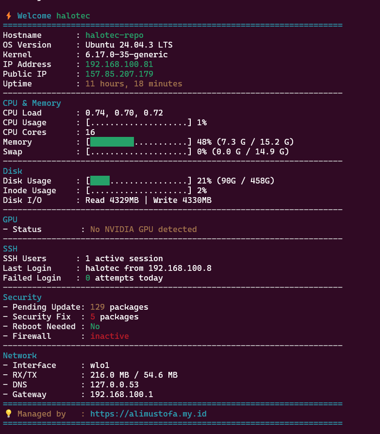

# ServerPulse MOTD

A colorful system dashboard and MOTD (Message of the Day) for Ubuntu/Debian servers displayed on SSH login.

## Overview

ServerPulse MOTD installs a dynamic system dashboard that displays comprehensive server metrics when users log in via SSH. It provides real-time visibility into system health, resource usage, and security status without requiring PAM configuration.



## Features

### System Information
- Hostname, OS version, kernel, IP addresses (local & public)
- System uptime

### Performance Metrics
- CPU load and usage with visual progress bars
- Memory usage (RAM and swap) with visual indicators
- Disk space and inode usage
- Disk I/O statistics

### GPU Monitoring
- NVIDIA GPU detection and support
- GPU utilization and memory usage
- GPU temperature and power draw
- CUDA version tracking

### SSH & Security
- Active SSH session count
- Last login information
- Failed login attempt tracking
- Pending system updates and security patches
- Firewall status (UFW)
- System reboot requirement status

### Network
- Network interface details
- RX/TX bytes transferred
- DNS configuration
- Gateway information

## Installation

### From DEB Package

```bash
# Build the package
./build-serverpulse-motd-deb.sh

# Install
sudo dpkg -i serverpulse-motd_1.6.0_all.deb
```

### Manual Installation

```bash
# Copy MOTD script
sudo cp 99-serverpulse /etc/update-motd.d/
sudo chmod 755 /etc/update-motd.d/99-serverpulse

# Copy profile.d script
sudo cp serverpulse.sh /etc/profile.d/
sudo chmod 755 /etc/profile.d/serverpulse.sh

# Update SSH config (optional but recommended)
sudo sed -i 's/^#*PrintMotd .*/PrintMotd no/' /etc/ssh/sshd_config
sudo systemctl restart ssh
```

## Testing

### Manual Test
Run the dashboard directly:
```bash
/etc/update-motd.d/99-serverpulse
```

### SSH Test
Log out and SSH back in:
```bash
exit
ssh user@server-ip
```

## Requirements

### Dependencies
- bash
- coreutils
- procps
- iproute2
- curl (for public IP detection)

### Recommended
- ufw (for firewall status)
- apt (for update checking)
- nvidia-utils (for GPU monitoring)

## How It Works

- Runs via `/etc/profile.d/serverpulse.sh` on interactive SSH sessions
- Collects system metrics from `/proc` filesystem and system utilities
- Displays color-coded status: green (healthy), yellow (caution), red (alert)
- Responsive to system state changes
- No persistent daemon required

## Uninstallation

```bash
sudo dpkg -r serverpulse-motd
```

## License

Created by Ali Mustofa <hai.alimustofa@gmail.com>  
Visit: https://alimustofa.my.id
